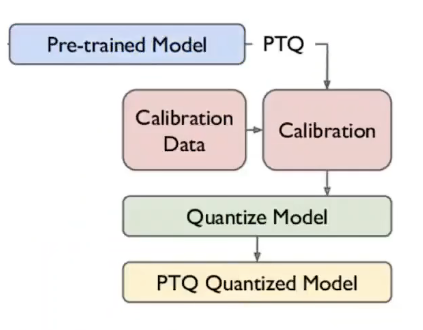

## Post Training Quantization(PTQ)


利用校正集预先计算好量化所需的参数，并存储到table中，再进行模型量化转int8
## 1. 优化模型
做一些算子的融合（此版本有bug，跳过这步）

`./ncnnoptimize ../../examples/squeezenet_v1.1.param ../../examples/squeezenet_v1.1.bin squeezenet_v1.1-opt.param squeezent_v1.1-opt.bin 0`
## 2. 计算映射表
使用kl量化出错，似乎有bug，采用acqi量化
```
# 生成图片路径索引的txt文件
find imagenet-sample-images/ -type f > imagelist.txt
# 计算table
# 对应参数: 模型路径、图片索引txt、预处理均值和方差、resize shape、编码格式、thread、映射方法（kl、aciq、eq）
./ncnn2table  squeezenet_v1.1.param  squeezenet_v1.1.bin ../../../imagelist.txt x.table mean=[104,117,123] norm=[1,1,1] shape=[227,227,3] pixel=BGR thread=1 method=aciq
```
## 3. 量化模型
利用生成的table将模型从float转化为int8

` ./ncnn2int8  squeezenet_v1.1.param  squeezenet_v1.1.bin   int8.param int8.bin  x.table`

## 4. 使用ncnn int8推理
将examples下的squeezent.cpp中的模型参数替换为生成后int8模型，重新执行make -j即可

量化前


量化后

